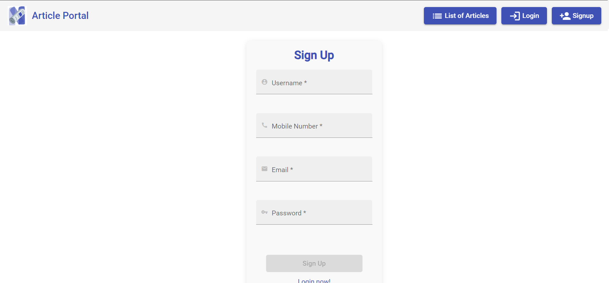
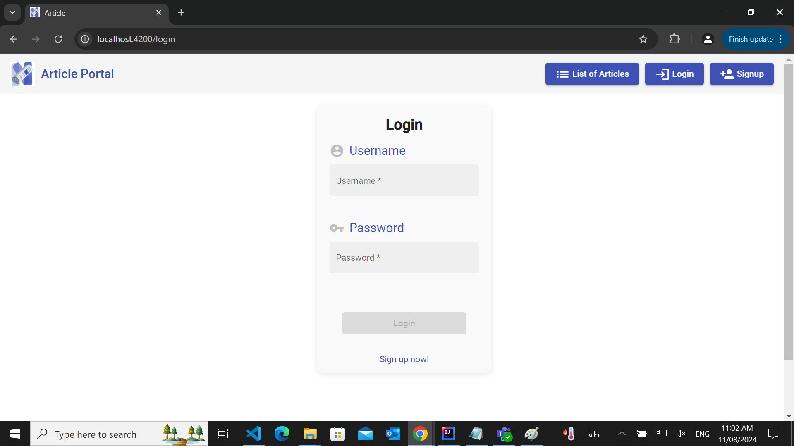
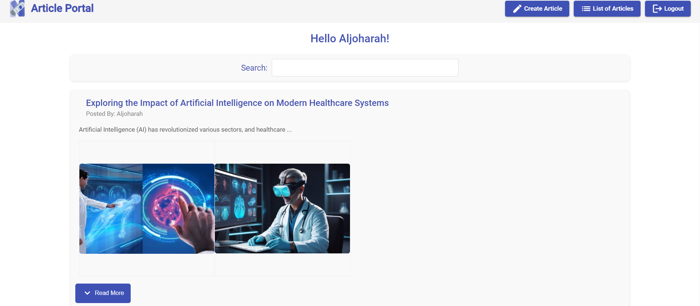
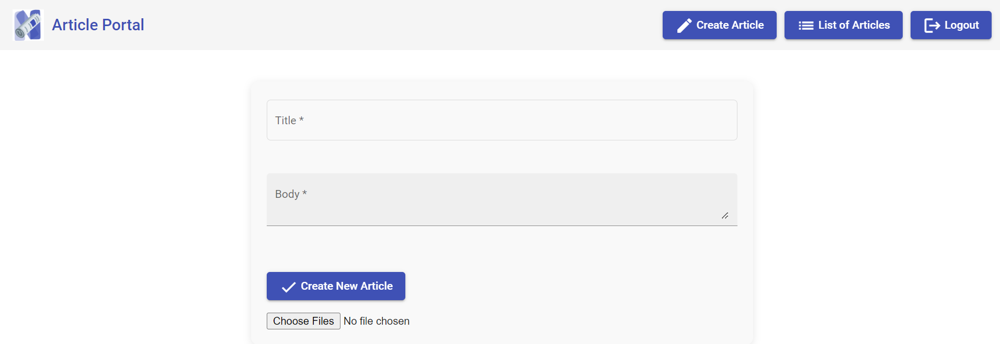
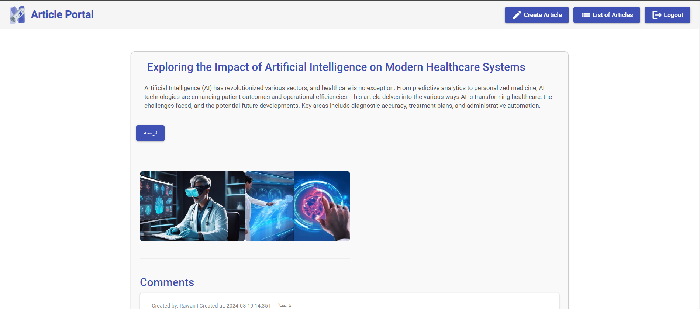
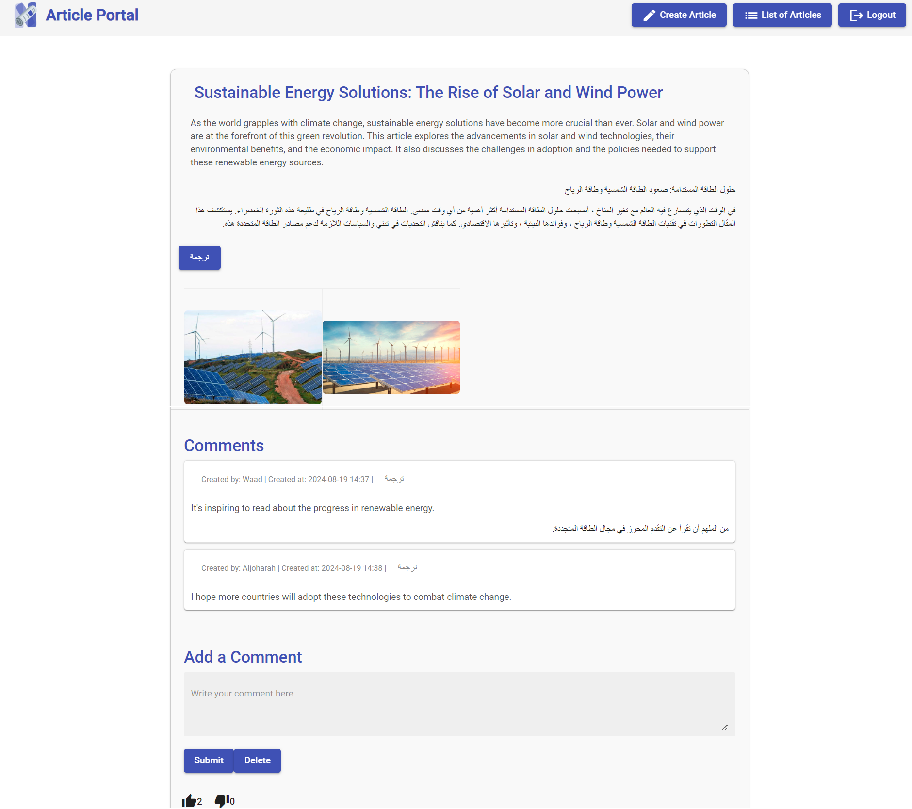
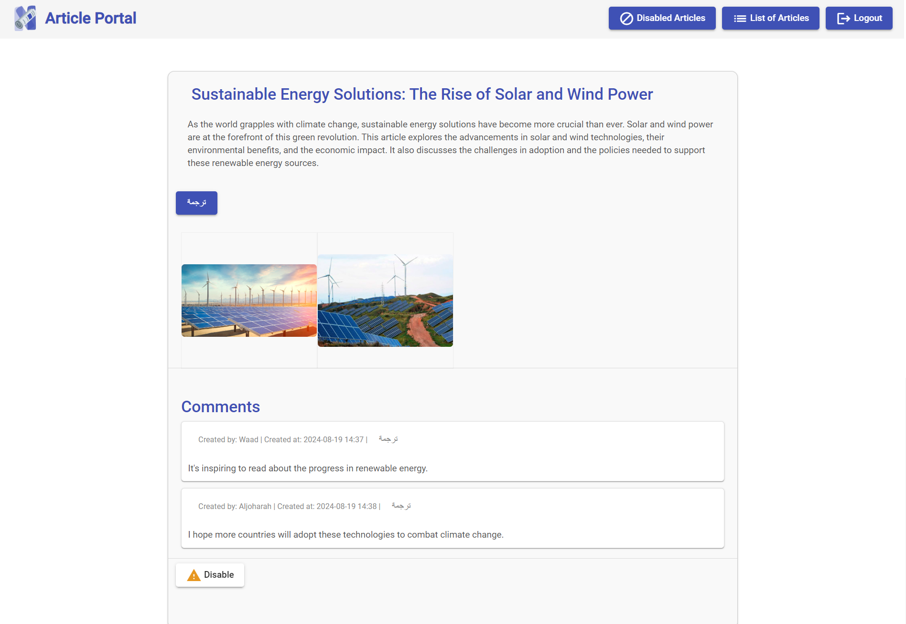

<p align="center">
  
</p>

<h1 align="center">Article Portal API</h1>

<p align="center">A Spring Boot RESTful API for a simple article portal with an Angular@14 frontend.</p>

## Table of Contents
- [Features](#features) - [Endpoints](#endpoints)
- [Examples](#examples) - [Frontend](#frontend)
- [Interfaces](#interfaces)

## Features
- Simple user registration
- User login and logout
- Post articles and comments for logged-in users
- Like and dislike articles
- Admin user controls for disabling articles
- Pagination for article listing
- Search for articles by content and title
- Validation using `@Valid` for all endpoints
- JWT-based authentication
- Translation of articles and comments using the [Helsinki-NLP/opus-mt-tc-big-en-ar](https://huggingface.co/Helsinki-NLP/opus-mt-tc-big-en-ar) AI model from Hugging Face

## Endpoints

| #   | URL                      | Http Method | Function                       | Description                                                                                                                                      | Privileges                       |
|-----|--------------------------|-------------|--------------------------------|--------------------------------------------------------------------------------------------------------------------------------------------------|----------------------------------|
| 1   | /user                    | POST        | Register a new user            | User fields: Username (unique), Mobile Number, Password, Email (unique), Privileges (list), Comments (list)                                       | Anonymous publicly allowed       |
| 2   | /login                   | GET         | Basic authentication           |                                                                                                                                                  | Anonymous publicly allowed       |
| 3   | /logout                  | GET         | Logout the logged-in user      |                                                                                                                                                  | For any logged-in user           |
| 4   | /article                 | POST        | Add new article                | Article fields (all required): Title (less than 100 characters), Body (less than 500 characters), Author (the logged-in username), CreatedAt, Number of likes, Number of dislikes, Disabled (boolean) | USERS only                       |
| 5   | /article/{id}            | GET         | Return an article of specific id | Id is a path variable of a specific article in the DB                                                                                            | Anonymous publicly allowed       |
| 6   | /article                 | GET         | Return the article list with pagination | Spring Pageable params                                                                                                                           | Anonymous publicly allowed       |
| 7   | /article/{id}            | DELETE      | Delete a specific article      | Id is a path variable of a specific article in the DB                                                                                            | Users can delete their own articles only. |
| 8   | /article/{id}/comment    | POST        | Create a comment for a specific article | Id is a path variable of a specific article in the DB, Comment fields (all required): Text ( < 100 character), CreatedAt, User (logged-in user name) | USERS only                       |
| 9   | /article/{id}/comment    | GET         | Return the list of comments of a specific article |                                                                                                                                                  | Anonymous publicly allowed       |
| 10  | /article/{id}/like       | PUT         | Add one like                   |                                                                                                                                                  | USERS only                       |
| 11  | /article/{id}/dislike    | PUT         | Add one dislike                |                                                                                                                                                  | USERS only                       |
| 12  | /article/{id}/disable    | PUT         | Disable the article            | make it true                                                                                                                                    | ADMIN only                       |
| 13  | /article/{id}/enable     | PUT         | Enable the article             | make it false                                                                                                                                  | ADMIN only                       |
| 14  | /api/translate           | POST        | Translate to Arabic            | Translates the provided article or comment content into Arabic using the AI translation model.                                                    | Anonymous publicly allowed       |


## Examples

### User Registration
```json
{
  "username": "user1",
  "mobileNumber": "1234567890",
  "password": "123",
  "email": "user1@gmail.com"
}
```

### Creating an Article
```json
{
  "title": "An Interesting Article",
  "body": "This is the body of the article"
}
```

### Posting a Comment
```json
{
  "content": "This is a very insightful article!"
}
```

## Frontend
The frontend of this article portal is developed using Angular@14 and Angular Material for styling. It includes components for user registration, login, article listing, article creation, and commenting. The Angular application communicates with the Spring Boot API to perform the necessary CRUD operations and display data to the users. Authentication is handled using JWT, ensuring secure and efficient user sessions.

## Interfaces

### Registration


### Login


### -User
#### Article List


#### Add Article


#### Article Details




### -Admin
#### Article Details



